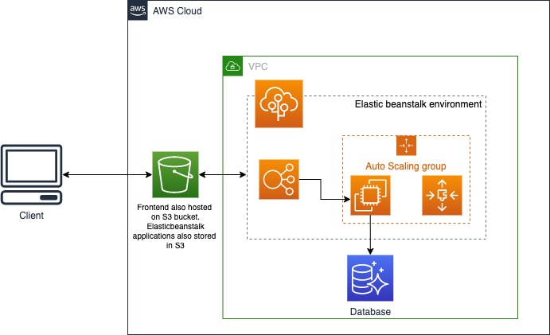

# Application Infrastruture

The applicaiton has been served using AWS cloud service. The description about individual piece of application is given below"

## Database

For storing all of application related data we are using Postgres DB from AWS Relational Database Service (RDS).

## Backend API

The application's backend is built using `NodeJS` and `Express`. It is been ran on Elastic Beanstalk environment which is using Node 14 platform. The code is built, archived and the uploaded to EB environment from circleCI on every push to master branch where is start the application server using the environment variables defined there.

The access point for EB is: `http://demo-env.eba-thcncujr.us-east-1.elasticbeanstalk.com/`

## Frontend

The frontend for the app is developed on Angular. The build is made and pushed to S3 bucket from CircleCI where static web hosting is being done.

The is currently accessible from: `http://udagram-fe-s3.s3-website-us-east-1.amazonaws.com`

